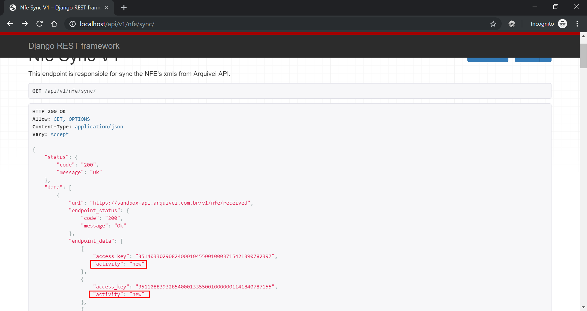
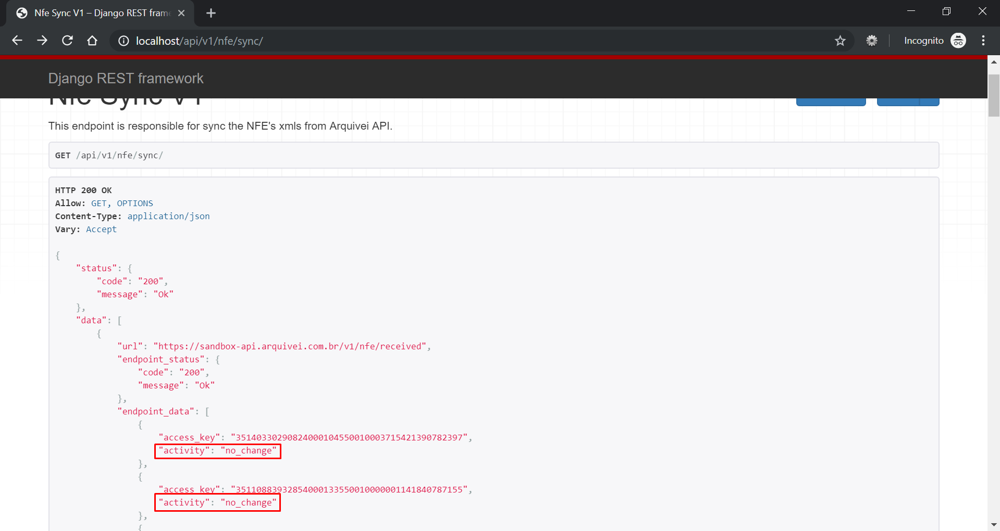
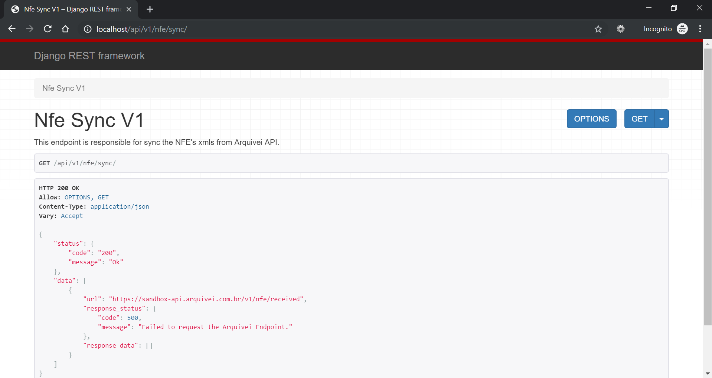
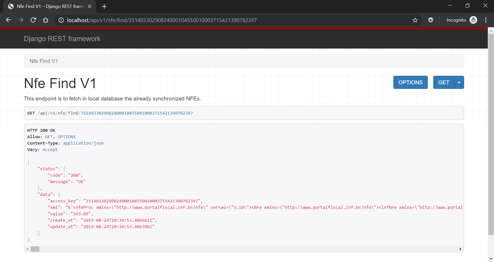
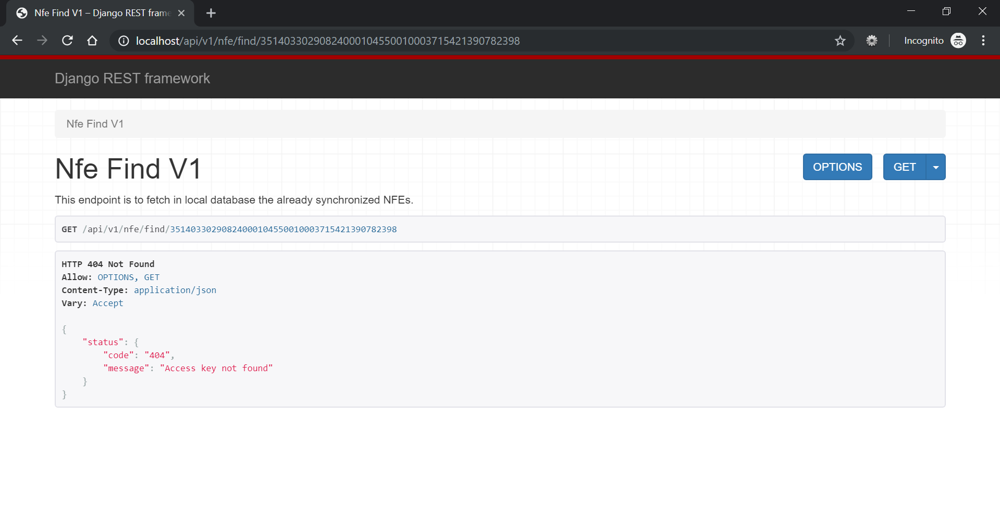

# nfe-py
This projects consumes the Arquivei's API to fetch a list of NFEs.

It was create using the Django and Django Rest Frameworks.


## Introduction
The goal of this project is to create an API layer that will consume the Arquivei APIs.

This project are composed by 2 steps:
* 1st. Sync the Arquivei API with the local database
* 2nd. Use the local endpoint to fetch a specific Access_key 


## Requirements

To install and run this project, you will need:
- Docker
- Docker-Compose

The Docker will be responsible to install the other dependencies.


## Installation Steps

After cloned this repository, you can install the project running the below commands in the repository root folder:
```
> docker-compose build
> docker-compose up 
```

Now, you just need to access the 2 local endpoints:
* SYNC: http://localhost/api/v1/nfe/sync/
* FIND: http://localhost/api/v1/nfe/find/35140330290824000104550010003715421390782397

You can consume using the Browser, Curl or any other client like Postman.

_Obs: The Django Rest Framework have an Browsable builtin tool to consume the created APIs. You can use it or any other client like CURL or POSTMAN_ 

## Details about the Endpoints:
#### SYNC
It is responsible to Sync the data from the Arquivei endpoint with te local database. 

This functionality was created as an Endpoint, but actually the best approach is to create as a Job, running it in a fixed time window. It was created this way to facilitate the execution of the project.

#### FIND
This endpoint will fetch a XML given a valid Access_key. 

If the Access_key don´t exist, it will answer a HTTP404 for incorrect Access_key.

The Access_key should have 44 decimal characters, otherwise it will throw a HTTP404 saying that the endpoint was not found. _(For this set the Debug=False)._ 

#### Settings
The project have some configurations:
* Environement/Database configuration: [./env.config](./env.config)
* Web Project and Endpoint configurations: [./web/nfe/settings.py](./web/nfe/settings.py)


## Considerations and Observations

* The migration of the DB is include as a step for Docker-compose to facilitate the execution. Usually it is done as a stand alone process, and not automatically.
* The Arquivei sandbox endpoint /v1/nfe/received apparently have a problem with the page.next variable. It is pointing to pages that don´t have data. A suggestion is to, when a page don´t have data, the page.next should be blank indicating no next page. 

## Screen Shots

__Sync valid - First request (new)__ 


__Sync valid - If the Access_key already exist in DB, it will be marked as no_change__


__Sync - error 500__


__Find - When the Empty was not execute and the Database is empty__ 


__Find - Valid request__


__Find - Access Key was not found__

